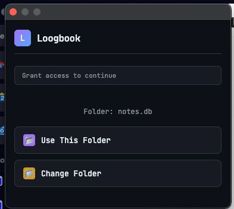

# Logbook

This is a project for managing your personal logbook.

### Problem:

Currently, I open many tabs in my browser, mostly for reading, and
there are some videos, but most are articles. I want to save these links locally
to remember what I wanted to read/watch later. Also, sometimes people ask me for links
about a certain topic, and I want to find them quickly.

# How to use

- First you select the folder where you want to store your logbook data.


- Then when you click in save Save to Read. It will save the link in `todo-read-list.md` at the select folder.
- When you click in Close & Archive it will close the tab and add to the `history.md`, so you can see later.
- When you click Mark as Read it will create the file `read-<year>-<month>.md` and add the link there.


## Features
- [x] Browser extension for managing reading lists with local file storage (v.0.1.0)
- [ ] Tagging system for categorizing links (v.0.2.0)
- [ ] Search functionality to find links by keywords or tags (v.0.3.0)
- [ ] Export and import logbook data (v.0.3.5)
- [ ] Improve the UI/UX of the browser extension (v.0.4.0)
- [ ] Add search on the UI/UX (v.0.4.1)

Those are planned features:

- [ ] Sync across devices, possibly using git and chrondb to store data.
- [ ] Remove folder storage and use database (sqlite, chrondb)

# Images

# Installation

To install the browser extension, follow these steps:


# Install the dev branch.

### 1. Clone the repository and build:
```bash
git clone git@github.com:jotlabsorg/logbook.git

cd logbook
npm install
npm run build
```
### 2. Open your browser's extension management page:
- For Chrome: `chrome://extensions/`
- Enable "Developer mode" using the toggle switch in the top right corner.
- Click on "Load unpacked" and select the cloned repository folder `dist/`.


